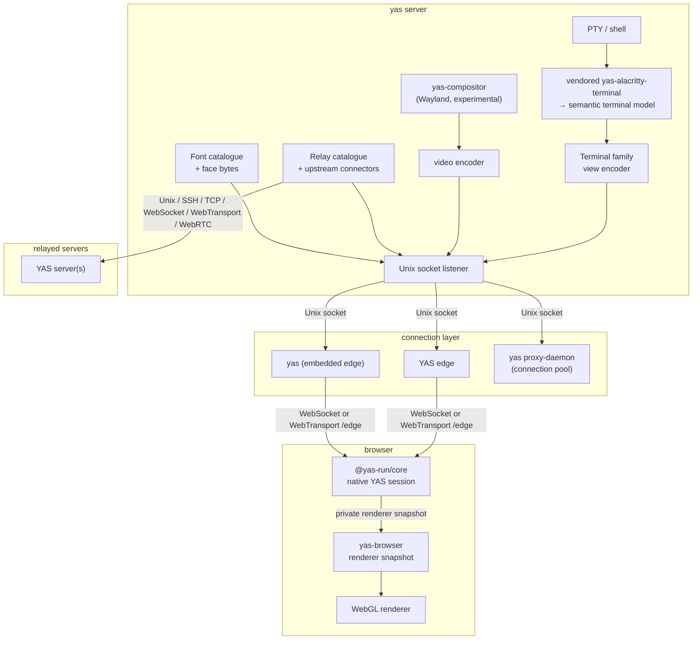
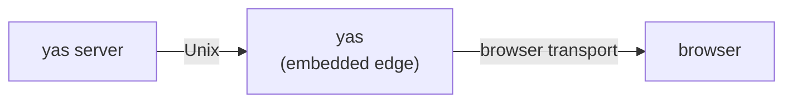
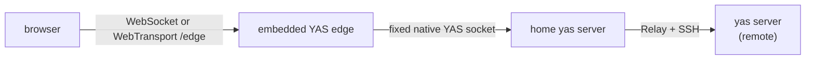
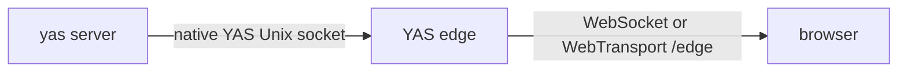
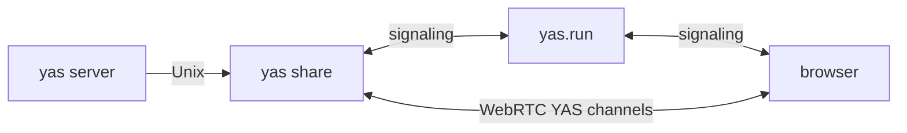

# Architecture

YAS is a native remote-workspace system. One versioned protocol carries
terminals, compositor surfaces, filesystem and Git state, language servers,
processes, network flows, media, extensions, and durable workspaces.
The terminal path parses PTY output into structured state and ships bounded
view frames; the browser renders those frames with WebGL.

Detailed references:

- [docs/design/yas.md](docs/design/yas.md) — canonical YAS wire protocol and family registry
- [protocol/yas/wire.md](protocol/yas/wire.md) — generated exact IDs, layouts, limits, and codec registry
- [docs/transports.md](docs/transports.md) — all transport options, topology diagrams, deployment patterns
- [docs/server.md](docs/server.md) — PTY lifecycle, compositor, frame pacing, server control
- [docs/color.md](docs/color.md) — Wayland color descriptions, linear composition, per-view P3/HDR encoding and presentation
- [docs/frontend.md](docs/frontend.md) — WASM runtime, WebGL renderer, glyph atlas, input handling

---

## System overview



The server owns PTYs, scrollback, parsed terminal state, catalogues, and
per-client view pacing. Edges and proxies do not own those resources and are
restartable; PTYs survive their restart.

---

## Crate map

| Crate                  | Directory                  | Kind          | Purpose                                                                                                          |
| ---------------------- | -------------------------- | ------------- | ---------------------------------------------------------------------------------------------------------------- |
| `yas-wire`             | `crates/yas/`              | lib           | Canonical YAS frame, family, descriptor, operation, policy, and payload codecs                                   |
| `yas-terminal-model`   | `crates/terminal-model/`   | lib           | Protocol-neutral terminal cells, styles, grids, bounds, and snapshots                                            |
| `yas-terminal-driver`  | `crates/alacritty-driver/` | lib           | Terminal parsing backend; snapshot generation, scrollback, title/mode tracking, and search                       |
| `@yas-run/browser`     | `crates/browser/`          | cdylib (WASM) | Consumes private renderer snapshots, produces WebGL vertex data, and manages the glyph atlas                     |
| `@yas-run/core`        | `js/core/`                 | npm           | Framework-agnostic core: transports, workspace, connections, terminal surface, WebGL renderer                    |
| `@yas-run/react`       | `js/react/`                | npm           | Thin React wrapper: context provider, hooks, `YasTerminal` component                                             |
| `@yas-run/solid`       | `js/solid/`                | npm           | Thin Solid wrapper: context provider, primitives, `YasTerminal` component                                        |
| `yas-server`           | `crates/server/`           | lib           | PTY host, frame scheduler, Relay route owner, and Font service. Listens on Unix socket.                          |
| `yas-edge`             | `crates/edge/`             | lib           | Authenticated fixed-home YAS WebSocket/WebTransport edge and web application host                                |
| `yas-ssh`              | `crates/ssh/`              | lib           | Embedded SSH client (russh): ssh-agent auth, `~/.ssh/config`, `direct-streamlocal` channels                      |
| `yas-proxy`            | `crates/proxy/`            | lib           | Native connection pool for socket, TCP, SSH, WebSocket, WebTransport, and WebRTC upstreams                       |
| `yas-uplink`           | `crates/uplink/`           | lib           | End-to-end Noise IK with pinned X25519 identities, AES-GCM, and authenticated datagrams                          |
| `yas` (CLI)            | `crates/cli/`              | bin           | Browser client, agent subcommands, SSH/proxy/share transports, `remote` management, `server`/`share` subcommands |
| `yas-webrtc-forwarder` | `crates/webrtc-forwarder/` | lib           | WebRTC bridge: signaling, STUN/TURN NAT traversal, peer-to-peer data channels                                    |
| `yas-fonts`            | `crates/fonts/`            | lib           | Server font catalogue, metadata, TTC extraction, embedding policy, and content hashing                           |
| `yas-webserver`        | `crates/webserver/`        | lib           | Shared axum helpers for authenticated web serving, passphrases, and hardened local IPC                           |
| `yas-website`          | `crates/website/`          | bin           | `yas.run` static site, installer redirects, and Redis-backed WebRTC signaling                                    |
| `yas-compositor`       | `crates/compositor/`       | lib           | Experimental headless Wayland compositor (wayland-server): surface multiplexing, input injection                 |
| `yas-sd-notify`        | `crates/sd-notify/`        | lib           | Tiny pure-`libc` `sd_notify(3)` for daemon readiness; no `libsystemd` dependency                                 |

Each Rust crate is a single `lib.rs` or `main.rs`. Larger crates (`yas-server`, `yas-compositor`, `yas-cli`, `yas-webrtc-forwarder`) use a small number of sibling files in the same directory.

The uplink producer in `yas-cli` and consumer in `yas-proxy` share `yas-uplink`.
The relay carries opaque Noise IK records. The producer requires a locally
allowlisted X25519 identity and fresh-session confirmation before opening local
IPC; the consumer pins the producer independently of the control plane.
Independent AES-GCM datagrams use directional session roots, counter-derived
key epochs, and a replay window. Browser clients can connect directly with
`YasUplinkTransport` using WebCrypto, or through a trusted home server's Relay
connector. `YasNoiseTransport` also wraps custom opaque carriers with routed
datagrams. See [uplink](docs/uplink.md).

### Dependency graph

```mermaid
graph TD
    wire --> cli[yas-cli]
    wire --> forwarder[yas-webrtc-forwarder]
    terminal[yas-terminal-driver] --> server
    terminalmodel[yas-terminal-model] --> terminal
    wire --> server

    compositor[yas-compositor] --> server
    server --> cli
    forwarder --> cli
    ssh[yas-ssh] --> cli
    ssh --> proxy[yas-proxy]
    forwarder --> proxy
    proxy --> server

    browser --> core[@yas-run/core]
    core --> react[@yas-run/react]
    core --> solid[@yas-run/solid]
    solid --> ui[@yas-run/ui]

    fonts[yas-fonts] --> server
    webserver[yas-webserver] --> server
    webserver --> edge["yas-edge package\n(YAS edge)"]
    webserver --> cli
```

`yas-proxy` depends on `yas-ssh` and `yas-webrtc-forwarder` for upstream SSH and WebRTC transport support.

---

## Deployment topologies

See [docs/transports.md](docs/transports.md) for the full transport reference. The most common topologies:

### 1. Local (`yas open`)



`yas open` auto-starts `yas server` if needed, embeds a temporary edge, and opens the browser. Everything runs in one user session.

### 2. Remote via SSH (`yas remote add host ssh:host && yas open`)



The home server watches its `remotes` KV key and publishes opaque Relay
routes. It
retains each route URI and credential, opens the SSH connection when the
browser connects the route, and carries the remote server as an independent
nested protocol session. The edge never sees the route or invokes SSH.

### 3. Persistent YAS edge (`yas edge`, or `yas server --edge`)



`yas server --edge` (or `YAS_EDGE=1`) runs the same edge inside the server
process: same listener, same authentication, same byte-for-byte mapping, with
the socket replaced by an in-process session that goes through the same
admission and classification an accepted socket does. One unit, one process,
one passphrase file. The standalone form remains for an edge that fronts a
server it does not live with.

For a permanent deployment. The browser authenticates `/edge` over the
baseline `yas.v1` WebSocket or an enabled WebTransport listener. WebSocket
messages map byte-for-byte to length-prefixed YAS frames. WebTransport pairs
its authoritative byte stream with native QUIC datagrams and a composite home
link. The edge does not parse frame headers, select destinations, read
the route catalogue, or serve fonts. Because its bearer passphrase grants full
server authority, every non-loopback browser transport must use TLS.

The fixed-home browser edge has no destination or configuration side channel.
Fonts and remotes are native YAS families served by the home server. Edge,
CLI/proxy, and custom browser transports carry the same YAS session, not an
adapter protocol.

### 4. WebRTC share (`yas share`, or `yas server --share`)



`yas server --share` (or `YAS_SHARE=1`) publishes the server from inside it.
Each consumer's session is opened in-process, so the socket and the yas-proxy
daemon that pools those connections for a standalone share are both absent.

No edge is required. The forwarder advertises a passphrase-derived public key
on the hub. The browser connects to the same channel using the same
passphrase-derived key and is identified by a unique session ID assigned by
the hub, so multiple consumers can connect concurrently. STUN/TURN handles NAT
traversal. The forwarder negotiates a native YAS session whose catalogue is
restricted to read-only operations before any application request is admitted.
The reliable `yas.v1` channel carries the preface and length-framed messages.
When both peers support native datagrams, the unreliable unordered
`yas.v1.datagram` companion carries one complete eligible Event per message;
otherwise every family uses its reliable fallback.

---

## Configuration files

One file under `~/.config/yas/` (or `$XDG_CONFIG_HOME/yas/`) stores persistent
state. The Relay catalogue used to live beside it and now lives in the
server's own KV store — see below.

### `yas.conf` — CLI defaults

`key = value` pairs. Browser preferences are device-local or stored in the
attached backend workspace; they are never transferred by the edge.

Special key: `yas.target = <uri-or-name>` — sets the default for non-browser
CLI commands. Browsers discover Relay routes from the home server and keep the
active route set in the attached backend workspace.

### The Relay catalogue — the `remotes` KV key

`name = uri` pairs, one per line, in the server's KV store under the key
`remotes`. Lines starting with `# name = uri` are **disabled** entries: kept
but excluded from connection resolution until re-enabled. Other `#` lines are
plain comments and ignored.

It is KV rather than a file for two reasons. The store is already per instance
(`<state>/yas/instances/<name>/kv.redb`), so a machine running two servers has
two catalogues rather than one shared home-directory file; and KV already has
watching, compare-and-swap and a client-facing family, so editing a remote
needed no transport of its own.

Managed with `yas remote add/remove/toggle/list`, which now reach the target
server rather than this machine's home directory — `yas --on dev remote add`
edits `dev`'s catalogue — and from the browser's Remotes panel. A server that
finds no `remotes` key at startup imports a pre-KV `yas.remotes` file once, if
there is one.

**The stored URIs carry credentials, and every client of the server can read
them**: a `share:` passphrase, an `ssh:` host reference. That is the trade for
letting clients administer remotes at all, and it is not a widening of
authority in practice — a client that can reach this KV store already holds
full authority over the server. What Relay _publishes_ is unchanged: revisioned,
credential-free snapshots of opaque handles, and only the server dials them.

---

## yas proxy-daemon protocol

`yas proxy-daemon` listens on a Unix socket in an effective-user-owned mode-0700 runtime directory (normally `$XDG_RUNTIME_DIR/yas/yas-proxy.sock`, with private `/run/user/$UID` or `/tmp/yas-$UID` fallbacks) and on a named pipe (`\\.\pipe\yas-proxy`) on Windows. The Unix daemon refuses unsafe parents, prebound non-sockets, symlinks, hard-linked lock files, and live-listener replacement; the socket is mode 0700 and its startup lock is mode 0600. Every Unix client authenticates the daemon's kernel-reported peer UID before sending a target URI or any embedded credential. Same-user is the default and root is accepted alongside it — those credentials belong to whoever called `listen()`, so a service-manager-activated listener reports the manager, and a peer that is already root could enter any UID regardless. An explicitly permissioned `YAS_PROXY_SOCK` may be paired with a numeric `YAS_PROXY_UID` for a deliberately cross-UID endpoint, and a missing foreign-UID daemon is never replaced by local auto-start. Clients declare their upstream target only after that authentication:

```mermaid
sequenceDiagram
    participant C as client (CLI or Relay connector)
    participant P as yas proxy-daemon
    participant U as upstream yas server

    C->>P: target-yas &lt;uri&gt;\n
    P->>U: connect (pooled or fresh)
    P->>C: ok\n
    note over C,U: yas wire protocol flows transparently
    C-->>P: yas frames
    P-->>U: yas frames
    U-->>P: yas frames
    P-->>C: yas frames
```

After `ok`, the proxy copies bytes bidirectionally between the client and a pooled upstream connection. The proxy is protocol-transparent and version-agnostic.

Upstream URI formats accepted by the proxy:

| Scheme    | Example                                        | Notes                                      |
| --------- | ---------------------------------------------- | ------------------------------------------ |
| `socket:` | `socket:/run/yas/server.sock`                  | Unix socket, no auth                       |
| `tcp:`    | `tcp:host:3264`                                | Raw TCP, no auth                           |
| `ws://`   | `ws://host:3264/edge#secret`                   | WebSocket, edge auth                       |
| `wss://`  | `wss://host:3264/edge#secret`                  | WebSocket+TLS, edge auth                   |
| `wt://`   | `wt://host:4433/?certHash=<sha256-hex>#secret` | WebTransport; system roots or explicit pin |

Passphrase and cert hash are embedded as query parameters in the URI so the pool can reconnect without additional configuration.

---

## URI scheme reference

All yas components share a common URI vocabulary for addressing yas server instances:

| URI                         | Where accepted                | Meaning                                   |
| --------------------------- | ----------------------------- | ----------------------------------------- |
| `local`                     | CLI, `yas.remotes`            | Local yas server (auto-start)             |
| `socket:/path`              | CLI, `yas.remotes`, YAS_DEST. | Unix socket / named pipe                  |
| `ssh:[user@]host[:/socket]` | CLI, `yas.remotes`            | Embedded SSH (russh) + auto-install       |
| `tcp:host:port`             | CLI, `yas.remotes`, YAS_DEST. | Raw TCP                                   |
| `ws[s]://host/edge#…`       | CLI, proxy, `yas.remotes`     | Fixed-home WebSocket (plain or TLS)       |
| `wt://host[:port]/#…`       | CLI, proxy, `yas.remotes`     | Native WebTransport endpoint              |
| `share:passphrase`          | CLI, `yas.remotes`            | Native read-only WebRTC share             |
| `share:passphrase?hub=URL`  | `yas.remotes`                 | WebRTC via custom hub URL                 |
| `proxy:uri`                 | CLI (`--on`)                  | Explicitly route through yas proxy-daemon |
| `name`                      | CLI (`--on`), yas.conf        | Named remote from yas.remotes             |

Set `YAS_PROXY=0` to bypass proxy routing and connect directly for `ssh:`,
`tcp:`, `ws:`, `wss:`, and `wt:` URIs.

The `ws://` form is suitable only on loopback or another confidential channel.
Because the edge passphrase carries full server authority, remote browser and
proxy deployments must use `wss://`/TLS.
